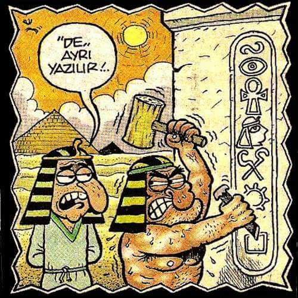
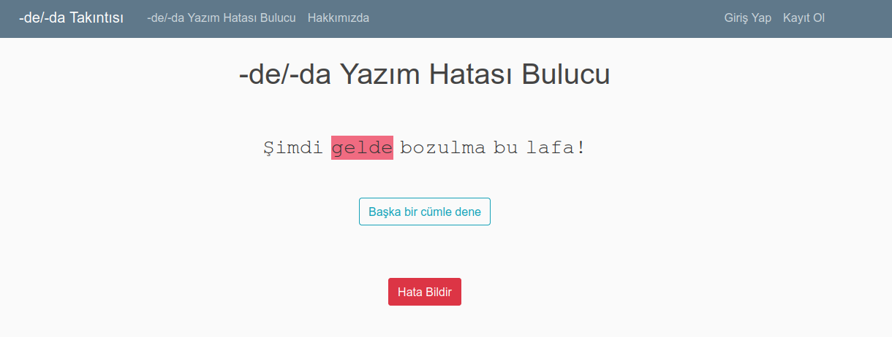

## Summary

The mispelling of de-da is a hot topic among Turkish speakers. Not only are there a lot of spelling mistakes for this case, it is can be quite triggering for many people. Unfortunately, spellchecker/correctors are not very successful in detecting these errors.
 

This project will further develop an exısting machine learning model [3] that detects the incorrect usage of Turkish clitic `de-da'. Then this model will be integrated into a web based application that is integrated into social media.
 

In particular a mechanism for collecting new de-da examples  from Twitter will be implemented and results will be shared. Also, functionality will be offered to detect misspelled words.
 
The coding will be in python. You must be comfortable with APIs and developing web applications. 

## Useful links:
- Complaints related to such mispellings are plenty: see: https://twitter.com/search?q=de%20ayri%20yazilir&src=typed_query

- The Role of Contextual Word Embeddings in Correcting the ‘de/da’ Clitic Errors in Turkish, Hasan Öztürk; Alperen Değirmenci; Onur Güngör; Suzan Uskudarli, SIU, 2020.

- An earlier work for exploring how well people can identify whether de-da should be together or apart: http://dedatakintisi.derlem.com/deda/bul/

